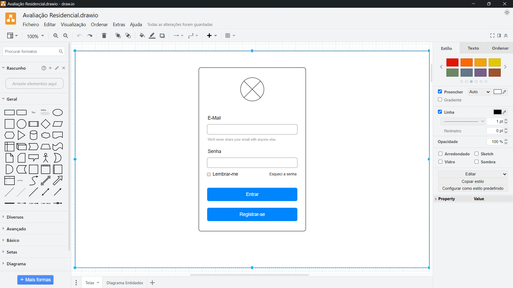
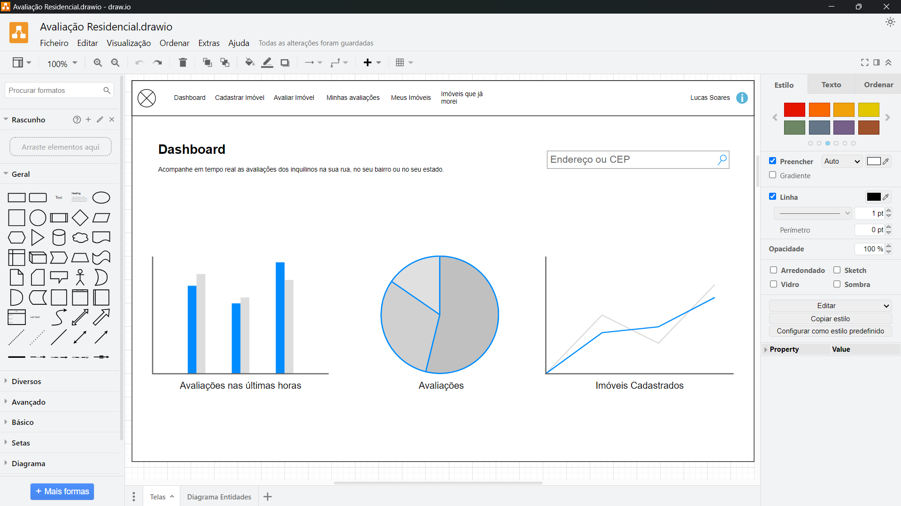

# App Property Evaluation in OutSystems

OutSystems Reactive application for Property Evaluations

## Table of Contents

- [Part 1 - Part 1 Title](#documentation-of-part-1)
- [Part 2 - Part 2 Title](#documentation-of-part-2)
- [Part 3 - Part 3 Title](#documentation-of-part-3)
- [Part 4 - Part 4 Title](#documentation-of-part-4)
- [Part 5 - Part 5 Title](#documentation-of-part-5)

## Readme en Portugués - PT

Si você é um leitor em português, clique no link abaixo:

- [Clique aquí](/README.md)

## Readme in Spanish - ES

If you are a Spanish reader, click the link below:

- [Click here](/README-ES.md)

-----------------------------------

## Documentation of Part 1

- Understanding the project through the template
- Creating the project in two modules: Web and Services
- Understanding the separation of responsibilities
- Creating the database architecture

### Mockups and Screen Template

Before starting the implementation, we began by understanding the screen mockups using **Drawio** and emphasizing the importance of having a visual template along with its benefits.

This visual planning helped ensure that all elements were clearly defined before implementation, providing clarity for the application’s use.

The screens include:

- Login Screen  
  
- Dashboard  
  
- Property Registration  
  
- Evaluate Property  
  
- Evaluate Property Pop-up  
  
- My Evaluations  
  
- My Properties  
  
- Properties I’ve Lived In  
  

### Project Structure

1. **AAR_Services Module (Service)**:
   - Responsible for the backend logic, including the database architecture, relationships, and CRUD actions.
   - The module is configured to be **public**, allowing other modules to access its read-only functionalities.
   - The entity architecture was designed to be clear and to ensure data integrity.  
     The entity (ER) diagram was created to facilitate visualization; below is a preview of each table:
     
   - **We created the ER diagram**:  
     
   - **Tables Created**:
     - **Immobile Table**: Contains data for registered properties, such as ZIP code, address, city, owner, among others.  
       
     - **Rating Table**: Stores property evaluations, including information such as rental duration, recommendations, and user observations.  
       
     - **TypeExperience Table**: Stores types of experience related to properties. It includes records such as **Excellent, Good, Neutral, Bad, Terrible**.  
       
     - **TypeImmobile Table**: Stores the available property types (e.g., House, Apartment, Store). It includes records such as **House, Apartment, Store**.  
       
     - **UserxImmobile Table**: Relates users to properties, indicating ownership and occupancy.  
       This auxiliary table stores the experience types, property types, and the relationship between users and properties.  
       
     - **User Table**: Uses OutSystems’ default entity to store user information, such as creation date and last modification date.  
       
2. **AAR_WEB Module**:
   - Responsible for the front-end and the screens of the application.
   - It is added as a dependency to **AAR_WEB** with read-only access, ensuring security and centralizing all server-side logic in the **AAR_Services** module.
   - In the web/reactive module, you can see all the tabs, including **Triggers, Interface, Logic, and Data**.  
     

### Conclusion

This first stage of the project included the initial configuration of the modules and the creation of the database entities, as well as the definition of the user interface.  
We used a modular approach that facilitates maintenance and data security by separating server logic from the front-end.

In the next stage, we will focus on finalizing the screen layouts in the **AAR_WEB** module, ensuring that all functionalities are aligned with the project’s objectives.

-----------------------------------

## Documentation of Part 2

- Creation of the Login Screen and Property Registration Screen, and their logic

### Login Screen

- On the right side, you can see that by default the OutSystems Login screen comes with:  
  

#### 4 Local Variables

- **Username**: Used in the **E-mail** input  
  
- **Password**: Used in the **Password** input  
  
- **IsExecuting**: Used to indicate execution in the ClientAction **OnInitialize**  
  
- **Remember**: Used in the **Remember me** checkbox input  
  

#### 3 Client Actions

- **ForgotPassword**: For password recovery  
  
- **Login**: Triggered by the **Enter** button  
  
  - The Login logic sets the local variable **IsExecuting** to True after the button is clicked:  
    
  - Then, it calls the ServerAction **DoLogin**:
    - Receives the local variables: Username, Password, Remember.
    - Persists the data and verifies that they were saved in the database.
    - Calls the default OutSystems Login ServerAction (within User).  
        
        
        
      
  - Afterwards, it removes a feedback message after login.
  - Finally, it redirects the user to the main screen:  
    
- **OnInitialize**:
  - Used to execute actions after the screen has loaded (as shown in the image below):  
    
  - It uses the local variable "IsExecuting" to implement the action, with the default being False (i.e., no action is executed on screen load).  
    

-----------------------------------

### Changing the Authentication Actions to the Correct Path

- This is because the server logic must reside in the **ARR_Service** module:
  - Simply cut the action from **ARR_WEB** and paste it into **AAR_Service** under the **Logic** tab, then publish.  
    
  - Make the action public before publishing so that other modules can access it.  
    
  - Then, adjust the dependencies (find the module, click it, add it, and click “Apply”).  
    The errors will disappear:  
    

-----------------------------------

## Property Registration Screen

### Module ARR_WEB

- Example screen:  
  
- From the **Data** tab, drag it to the **MainFlow**:
  - Both screens are created:  
    
  - **Immobiles**: List screen  
    
  - **ImmobileDetail**: Detail (registration) screen
    - Remove the default IF (which shows "Cadastrar" or "Editar") and replace it with an Expression:
      - If ImmobileId is null, display "Cadastrar"; otherwise, display "Editar" concatenated with " Property":

        ```javascript
        If(ImmobileId = NullIdentifier(), "Cadastrar", "Editar") + " Property"
        ```

    - Remove the Form from within Column1 so that it expands:  
        
      
    - Drag the **Adaptive/Columns2** component into the Form to divide the columns:  
      
    - The adjusted layout appears as follows:  
      
    - Replace the checkbox with a radioGroup for improved visual appearance:
      - Set the Label to None (i.e., no binding) and adjust the button positions.  
        
    - Check the ClientAction **SaveDetail** to verify that data is being persisted correctly:  
      
      - Note: Data persistence is not active yet.  
        
      - Visual view of the screen:  
        

### Module: ARR_Services

#### Register and Edit Property Screen

- To persist data on the "Register Property" screen:
  - Create a folder named after the corresponding Table.
  - Here you will create the action that persists the data.

- **Server Action: Immobile_CreateOrUpdate**  
  
  - The action expects:
    - **Input Parameter**: Immobile  
      (This parameter is used to persist data to the Immobile Table.)
    - **Output Parameter**: Output  
      - Create a Structure for the Output:  
        
      - Configure the attributes:
        - Success (default value: false)  
          
        - Message  
          
        - AccessKey  
          
        - Id (Long Integer)  
          
      - Once the Structure is created, set up the Output Parameter:  
        
  - Create the flow for the ServerAction:  
    
  - **Initial Validation:**  
    - Check if the user is equal to NullIdentifier():  
      
  - If **Immobile.Id** is null (new record):
    - If true: Execute **CreateImmobile**
    - If false: Execute **UpdateImmobile**  
      
    - In the case of a new record, fill in the **CreatedBy** and **CreatedAt** fields before persisting:  
      
    - In the Source, remove the Immobile and add the fields individually:  
      
    - > ⚠️ **NOTE:** Ensure that you use the values from the input parameter for each field, except for **CreatedBy** (use GetUserId()) and **CreatedAt** (use CurrDateTime()).  
        
        
      
    - The **CreatedBy** and **CreatedAt** fields are the only ones that do not take their values from the input parameter:
      - **CreatedBy:** assign using the GetUserId() function
      - **CreatedAt:** assign using the CurrDateTime() function  
        
    - Note:
      - In **UpdateImmobile**: Directly assign the input parameter.  
        
      - In **CreateImmobile**: Assign the fields individually, styling the CreatedBy with GetUserId().  
        
  - Assign the output parameters:
    - **1st:** Create an Assign for CreateImmobile where Output.Id receives the ID from CreateImmobile.  
      
    - **2nd:** Create an Assign for UpdateImmobile where Output.Id receives the ID from the updated record.  
        
      
- >❗ **EXCEPTION:**  
  - Add an exception to the flow by selecting "All Exceptions".
  - In an Assign, set:
    - Output.Success = False
    - Output.Message = AllExceptions.ExceptionMessage  
      
  - In AllExceptions, the exception aborts the flow (Abort Transcription = Yes).  
    

### Module: ARR_WEB

- Remove elements that will not be used:
  - For example, delete the Aggregate **GetUsers**:  
      
    
- Create the flow for the **Client Action: SaveDetail**:
  - First, validate if the form is invalid (False):  
    
  - If the form is valid, call the ServerAction Immobile_CreateOrUpdate (passing the Immobile parameter):  
      
    
  - Use an IF to check if the persistence was successful:
    - If not, display an ERROR message (Output.Message):  
      
    - If successful, display a SUCCESS message and redirect to the **Immobiles** list screen:  
      
    - End with a REDIRECT:  
      
- Verify on-screen that the data is being persisted (note: the ZIP code is still fictitious; an API will be used for the ZIP code):  
  

### NEXT STEP

- ✨ **IMPLEMENTING THE ZIP CODE (CEP)**:
  - 🛠️ Create an **OnChange** action for the **CEP** field.
  - ✏️ When the **CEP** field is modified, an OnChange event will trigger a service; if the CEP exists, it will automatically fill in the address, neighborhood, and city.

-----------------------------------

## Documentation of Part 3

- Creating Screens and the Login and Property Registration logic:
  - Adjustments in labels
  - Using a Forge component (API)
  - Securing the application with AccessKey
  - OnChange events
  - OnScroolingEnd event
  - Generating a random AccessKey
  - Using a Widget List instead of TableList
  - Joins between tables
  - My Properties screen
  - Evaluate Properties screen

## Start

## Generating a Random AccessKey

- Up to now, for editing or actions shown in the URL, the ID is exposed, which creates a vulnerability.
- As a security measure, we will use the AccessKey, which masks this ID.  
  

### Access Key in ARR_SERVICES

- In the Services module, the ServerAction (**Immobile_CreateOrUpdate**) outputs the parameters (*Success, Message, AccessKey, Id*).
- However, the (**CreateImmobile**) flow does not yet receive the **AccessKey** because it has not been assigned to the table.  
  

#### Creating the Access Key

- 1º Create an attribute in the Immobile table on the **Data** tab:
  - This attribute should be of type **Text** (since it will receive a HASH).  
      
    
- 2º Once the attribute is created, return to the flow of the ServerAction (**Immobile_CreateOrUpdate**) in the **CreateImmobile** branch; the AccessKey attribute will now be available.
  
- 3º Use a system function to generate the AccessKey:
  - In the dependencies, add the ServerAction (**GenerateGuid**).  
    
- 4º Return to the flow of the ServerAction (**Immobile_CreateOrUpdate**) and assign the value generated by GenerateGuid to the Immobile’s AccessKey attribute.  
  
  - Thus, every time a new record is created, an AccessKey will be generated.
- 5º Publish, then go to ARR_WEB.

### Access Key in ARR_WEB

- Once the **ARR_SERVICES** part is complete, update the dependencies in ARR_WEB (Refresh all → Apply → Publish).  
  
- 1º The **ImmobileDetail** screen expects an input parameter (**Immobile Identifier**); change it to **AccessKey**:
  - DataType: **Text** (since a hash is expected).
  - It does not need to be mandatory.
  - You will also need to modify the GET and the list to reflect this change.  
    
- 2º Modify the **GetImmobileBy**:
  - When you click it, you will see an error comparing an Identifier with different data types, because the parameter changed from Id to AccessKey. Adjust the filter to compare **Immobile.AccessKey** with the **AccessKey** parameter.  
    
- 3º In the filter of **GetImmobileBy**, set the MaxRecord to 1 (since a unique search is expected).  
    
- 4º In the properties list, change the input parameter to **AccessKey**.  
      
      
    

-----------------------------------

## Using the Forge Component (API) for CEP

- ✨ **IMPLEMENTING CEP**:
  - 🛠️ Create an **OnChange** action for the **CEP** field.
  - ✏️ When the **CEP** field is modified, an OnChange event will trigger a service; if the CEP exists, it will automatically fill in the address, neighborhood, and city, otherwise, it will display an error message.

### Downloading the Component from the Forge (ViaCEP)

- Download the ViaCEP - Endereços component:
  - In the **Forge** tab, search for **ViaCEP** and, once found, install it in the Studio.  
    

### Applying in ARR_WEB

- 1º This component is a separate application (ViaCEP); therefore, you must reference it in your project just as you do with ARR_Service.
  - Click on the plug and add it to your project.
  - It has a ServerAction (**CEP**) that takes a parameter (CEP) and returns an Output with address data (via a Structure with fields such as CEP, Logradouro, Complemento, Bairro, Localidade, Uf, Ibge, …, Erro).  
    
  - Once applied, it will appear in the **Logic** tab.  
    
- 2º In the screen, in the **CEP** input, create an OnChange action that, when the field is modified, triggers a process to call the CEP service.  
      
    
- 3º Applying the logic:
  - Add an IF: if the length of the CEP is greater than 7 (i.e., 8 characters or more):

    ```js
    Length(GetImmobileByAccessKey.List.Current.Immobile.CEP) > 7
    ```

  - If false, exit; if true, call the ViaCEP API to retrieve the CEP information.
    
  - Drag the **Via_CEP : CEP** ServerAction from the Logic tab, configure its parameters, and connect it to the IF condition.  
      
    
  - Configure the input fields to automatically receive the values from the CEP service’s Output:
    - 1º Check if the CEP service returned data.
    - 2º If CEP.Output.Erro is True, exit.
    - 3º Otherwise, use an Assign to fill in the address fields with the data from CEP.Output.  
        
        
        
      
    - 4º Create an additional Assign to clear the fields if, upon changing the CEP, the service returns an error (i.e., CEP.Output.Erro is True).  
      
    - ⚠️ **NOTE:** The OnChange event allows you to fetch and manipulate any information based on the value entered.

-----------------------------------

## My Properties

- Property Listing Screen:
  - Initially, reuse this screen to create the properties listing.  
    
- Make the initial adjustments to match the template design:
  - 1º Change the name of the page.
  - 2º Remove the "Casa" link (as it will be used in the address editing).
  - 3º Adjust the position of the columns.
  - 4º Rename the button to **Cadastrar Property**.
  - 5º Add the edit link in the **Address** column.
  - 6º Add an **Action** column with the **Delete** icon.
  - 7º Add the **Registration** column.  
    
- Configure the **Expressions** so that they display the correct values in each column:
  - 1º **Evaluations**: Displays the sum of evaluations for the property.
    - To do this, adjust the Aggregate (GetImoveis) to perform a join with the evaluations table and group the information:
      - Create a join:  
        
      - Configure the join as **With or Without** to retrieve records with or without evaluations.
      - Use **Group by** and **Count** to group and count:
        - Group by (e.g., ZIP, Id, Street, Number, CreatedAt, Property Type, AccessKey)  
          
        - Count: the number of grouped records  
          
      - The Aggregate will then display only the grouped fields:  
        
      - Remove any reordering of columns:  
        
      - Update the Expressions to use the new values from the Aggregate:  
        
      - Final result:  
        
  - 2º Adjust the formatting of the **Created on** field using the DateFormate() function:  
    
  - 3º Adjust the **Search** action to search by both ZIP and Address:  
    
- Creating the **DELETE** Action:
  - 1º Create an initially empty ClientAction in the ARR_WEB module.
  - 2º In the ARR_Server module, create the ServerAction for deletion:  
    
  - 3º In the **Data** tab, drag the Delete action from the Immobile table to the ServerAction, adding the ID parameter for the Delete CRUD.  
    
  - 4º Configure the CRUD Output (the deletion output).  
    
  - 5º Create the exception flow (AllExceptions):  
    
  - 6º Return to the ARR_WEB module and set up the flow that calls the ServerAction and displays success or error messages:  
      
      
      
    

## Evaluation Screen

- **1º** Organize the Evaluation Screen using a **List** component (Main Content > List > Container > Content\CardsSectioned).  
  
- **2º** Create a specific Aggregate for this screen:
  - Relate the **Immobile** table with **UserXImmobile** (to obtain the properties where the user has lived).
  - Relate **Immobile** with **TypeImmobile** (using an Only With join).
  - Relate **Immobile** with **Rating** (using a With or Without join).
  - Group the information and count the evaluations:
    - Group by: Immobile.Id, Immobile.Street, Immobile.Street_Number, TypeImmobile.Label, Immobile.AccessKey  
    - Count: Rating.Id  
    
- **3º** Add the Aggregate to the Source:
  
  - Update the Expressions and style the Container:  
    
  - Create a Group By on **TypeImmobile.Id** to display an icon corresponding to the property type:  
    
  - Create an IF to display the icon based on **TypeImmobile**:  
    
- **4º** Implement infinite scrolling so that as the user scrolls, more records are loaded:
  - Configure the **On Scroll Ending** event of the List component to trigger a ClientAction (e.g., "New Infinite Scroll Client Action").  
      
    
  - The "ScrollEnding" ClientAction uses a local variable **MaxRecords** to define how many records are initially displayed.  
      
      
    

-----------------------------------

## Documentation of Part 4

### Evaluation Modal, My Evaluations Screen, Properties I’ve Lived In, and General Adjustments

- Menu adjustments
- Evaluation modal
- Data persistence
- My Evaluations screen
- Properties I’ve Lived In screen
- General adjustments

#### Creating the Evaluation Modal

- Modal display example:  
  
- **1º** In the ARR_SERVICES module, create the ServerAction **Rating_CreateOrUpdate**:
  - Flow:
    - If it is a new record, use the "CreatingRating" CRUD and assign via an Assign:
      - Output.Succes = True  
      - Output.Message = "Evaluation created successfully"  
      - Output.Id = CreateRating.Id
    - If it is not a new record, use the "UpdateRating" CRUD and assign:
      - Output.Succes = True  
      - Output.Message = "Evaluation updated successfully"  
      - Output.Id = Rating.Id
    - Both flows end successfully.
    - In case of an exception, use AllExceptions to assign:
      - Output.Succes = False  
      - Output.Message = AllExceptions.ExceptionMessage  
      
      
      
      
      
      
      
    
- **2º** In the ARR_WEB module, create the Evaluation Modal (Pop-up):
  - Add a component for the modal and define a local variable **ShowPopupRating** (Boolean, default False).  
      
    
  - Bind this variable to the modal.
    
  - Create a ClientAction (e.g., **ShowPopupRating**) that toggles the variable (to open/close the modal).  
      
    
  - Create a local variable to store the **Rating** table data that will be used in the modal’s form.  
    
  - Adjust the modal structure (title, subtitle, form fields) according to the mockup.  
    
- Additional adjustments:
  - 1º Replace the checkbox input for recommendations with a **Radio group** (options: Yes or No).  
      
      
    
  - 2º Replace the "Observation" field with a **textArea** and set its Label to "None".  
    
  - 3º Configure the modal title and description to be dynamic by using local variables (e.g., "TypeImmobile" and "ImmobileAddress") that are set in the **ShowPopupRating** action.  
      
    
  - 4º Capture the evaluation ID when clicking, using the local Rating variable.  
      
      
    
  - 5º To persist the modal data, create the ClientAction **SaveOnClick** that:
    - Calls the ServerAction **Rating_CreateOrUpdate**.
    - Uses an IF to check if the Output indicates success or error and displays the corresponding message.
    - If successful, clears the local variables (title, description, ID) and closes the modal (by setting ShowPopupRating = False).  
      
      
      
      
      
      
    
  - 6º In the ServerAction **Rating_CreateOrUpdate** (in the Services module), configure the **CreatedAt** field (using CurrDateTime()) and the **CreatedBy** field (using GetUserId()).  
    
    - Then update the dependencies in the Web module so the changes are reflected.  
      
  - 7º Create the "MyRating" screen so that, after confirming the modal, the user’s evaluations are listed:
    - From the **Data** tab, bring in the Immobile table (which already has relationships between Immobile, TypeImmobile, and User).
    - Create a join with the **Rating** table to fetch the evaluations.
      - Use an Only With join to fetch only the records that have evaluations.
      - Add a filter so that the logged-in user sees only their evaluations:

        ```js
        Rating.CreatedBy = GetUserId()
        ```

      
      
    
    - Organize the table to include the columns: Address, ZIP, Evaluations, Recommendations, and Date (use functions like DateTimeToDate for formatting).  
      
    - Create a "Search" field to search evaluations by street or ZIP:
      - Add an Input Search with an appropriate placeholder.
      - Define a local variable "SearchRating" (Text) to capture the input.  
        
      - Configure the OnChange action (e.g., "SearchOnChange") to update the table only if the input length is >= 3 or equals 0:

        ```js
        Length(SearchRatings) >= 3 or Length(SearchRatings) = 0
        ```

        
      
      - In the Aggregate, create a filter using LIKE on the street and ZIP fields.  
        

-----------------------------------

## Documentation of Part 5

- **In this Part:**
  - Menu adjustments
  - Edit event (on the My Evaluations screen)
  - Dashboard screen
  - How to fetch data for charts from the Services module
  - How to manipulate the chart data
  - Adding an attribute in the Aggregate
  - Using Switch
  - Properties I’ve Lived In screen
  - General adjustments

### Adjusting the Menu

- Configure the menu with consistent names to facilitate navigation.  
  

-----------------------------------

### Creating the Dashboard Screen

- The Dashboard will display charts with important metrics.
- 1º In the Services module, under the "Logic" tab, create a folder for Dashboard-specific server actions.  
  
- 2º Create a ServerAction for each chart.  
  
  - These actions must be public so that they can be consumed in the Web module.  
    
- 3º Creating the ServerAction for Rating (Evaluations):
  - I - Drag an Aggregate and add the **Rating** table.
  - II - Create a join (Only With) with the **TypeExperience** table.
    - Perform a Count on Rating.ID and group by TypeExperience.Label.  
        
      
  - 4º Transfer this data to a structure compatible with charts using **DataPoint**.
    - Add 2 output parameters:
      - Output: the structure with a message and success flag.
      - An output parameter of type List of DataPoint.  
        
        
        
      
  - 5º Structure the flow of the ServerAction (Rating):
    - I - Create the Aggregate with the joins and configure the output parameters.
    - II - Use the ListAppendAll action to transfer the Aggregate data to the DataPoint.
    - III - With an Assign, set:
      - Output.Success = True  
      - Output.Message = "Data collected successfully"
    - IV - Configure the exception flow (AllExceptions):
      - Output.Success = False  
      - Output.Message = AllExceptions.ExceptionMessage  
        
        
        
      
- 4º Creating the ServerAction for ImmobileRegister:
  - Similarly, create a ServerAction to obtain the count of Immobile records by creation date.
  - I - Add the input, Output, and Source parameters.
  - II - In the flow:
    - Drag the **Immobile** table.
    - Perform a Count on Immobile.Id and group by Immobile.CreatedAt.
    - Use ListAppendAll to populate the DataPoints (Value = Count, Label = CreatedAt).
    - With an Assign, set:
      - Output.Success = True  
      - Output.Message = "Data collected successfully"
    - Configure the exception flow similarly.  
        
        
        
        
      
- 5º In the Web module, update the dependencies and create the charts:
  - Create a screen named **Dashboard**.
  - Add a title and subtitle.
  - In the Widget Tree, create a Card with a 3-column layout:
    - In Column 1, add a **PieChart** component.
    - In Column 2, add a **LineChart** component.
  - In the Interface > Elements tab, create “Fetch Data from Other Source” actions for the charts:
    - Right-click on the Dashboard screen and select "Fetch Data from Other Source".
    - In the flow, drag the ServerActions for RatingGraph and ImmobileRegisterGraph.
    - With an Assign, set:
      - For RatingGraph: DataPointList = RatingGraph.DataPoint
      - For ImmobileRegisterGraph: DataPointList = ImmobileRegister.DataPoint
    - Configure the outputs of each Fetch as List of DataPoint.
    - In the chart components, set the DataPointList property using the Fetch outputs:
      - PieChart: RatingGraph.DataPointList
      - LineChart: ImmobileRegisterGraph.DataPointList  
        
        
        
        
        
        
        
        
        
        
        
      

-----------------------------------

### Creating the "Properties I’ve Lived In" Screen

- In this screen, the goal is to use a calculated attribute in the Aggregate.
  - Set the Dashboard as the main screen.
  - Create a screen named **ImmobileLived**.
  - In the Aggregate for this screen:
    - Add the **Immobile** table and perform a Join with the **UserXImmobile** table.
    - Display the fields: Property, ZIP, Address + Number.
    - Add a Switch to indicate if you have lived in the property.
      - Create a new attribute (New Attribute) in the Aggregate with the formula:

        ```js
        CreatedAt <> NullDate()
        ```

  - Bind this attribute to the Switch component.
- In the Services module, create the logic for the Switch:
  - Create 3 ServerActions:
    - **UserXimmobile_CreateOrUpdate**: to create or update the record.
    - **UserxImmobile_Delete**: to delete the record.
    - **StatusChange**: to determine, based on the Switch status, whether to create or delete the record.  
        
        
        
        
      
- In the Web module, update the dependencies and configure the Switch:
  - In the Switch component, bind the local variable to receive the attribute value (e.g., `GetImmobiles.List.Current.Check`).
  - Configure the OnChange event to call a ClientAction (e.g., "SwitchOnChange") which, in turn, invokes the ServerAction **StatusChange** with the necessary parameters.  
    
  - In the "SwitchOnChange" ClientAction, handle the response:
    - If Output.Success is True, display a success message.
    - Otherwise, display an error message.  
        
        
      
- Finally, create an Input Search for the table:
  - Create a local variable "SearchImmobile" of type Text.
  - In the Aggregate, limit Max.Record to 10 and create a filter to search by ZIP and Address.  
      
      
    
