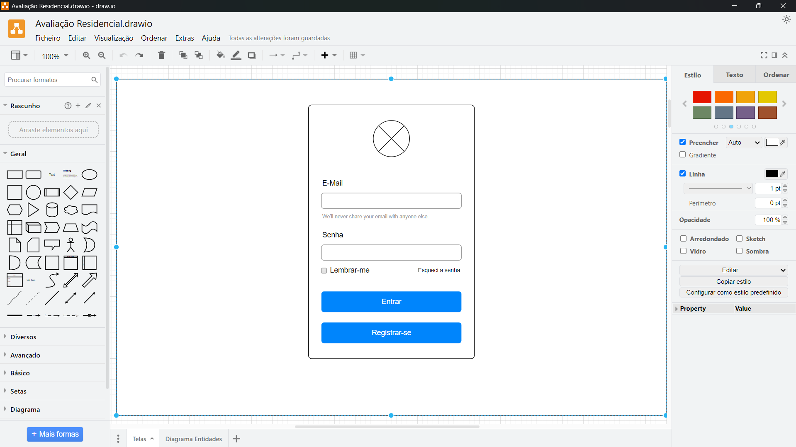
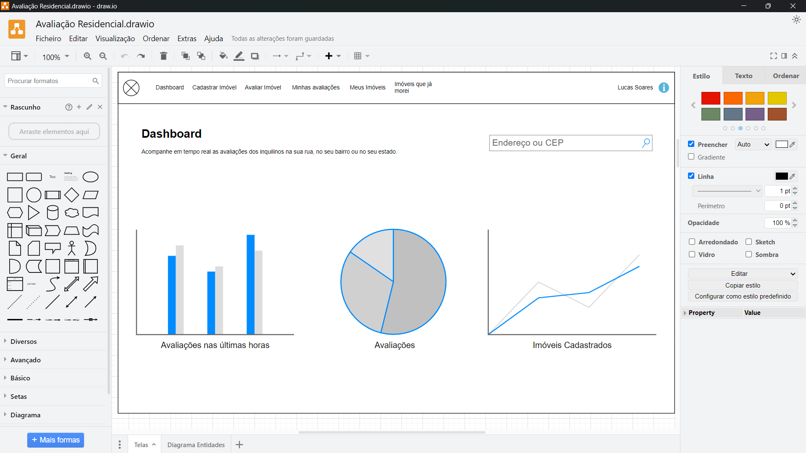
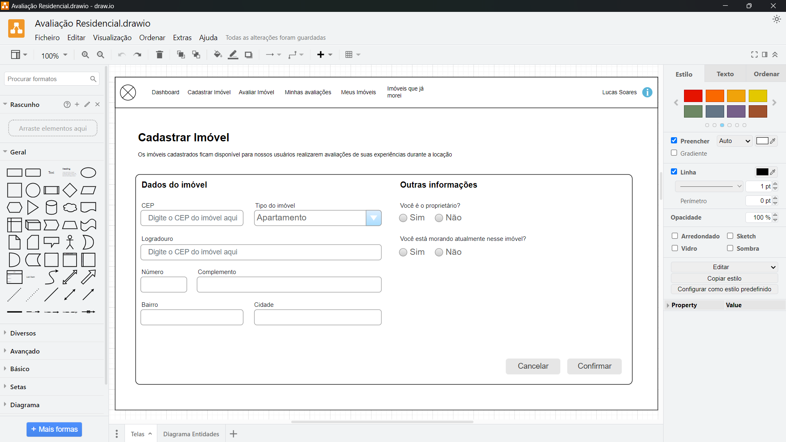
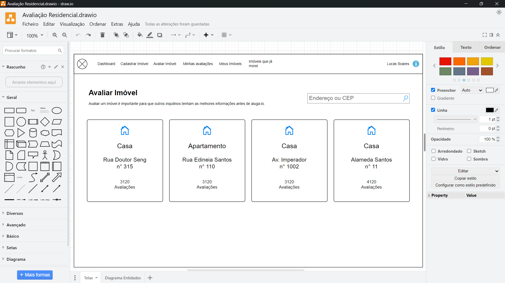
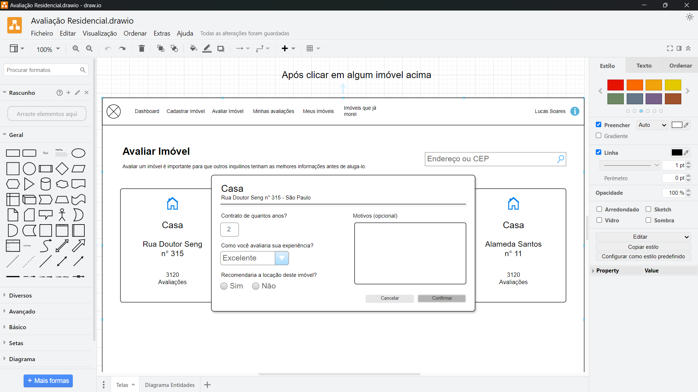
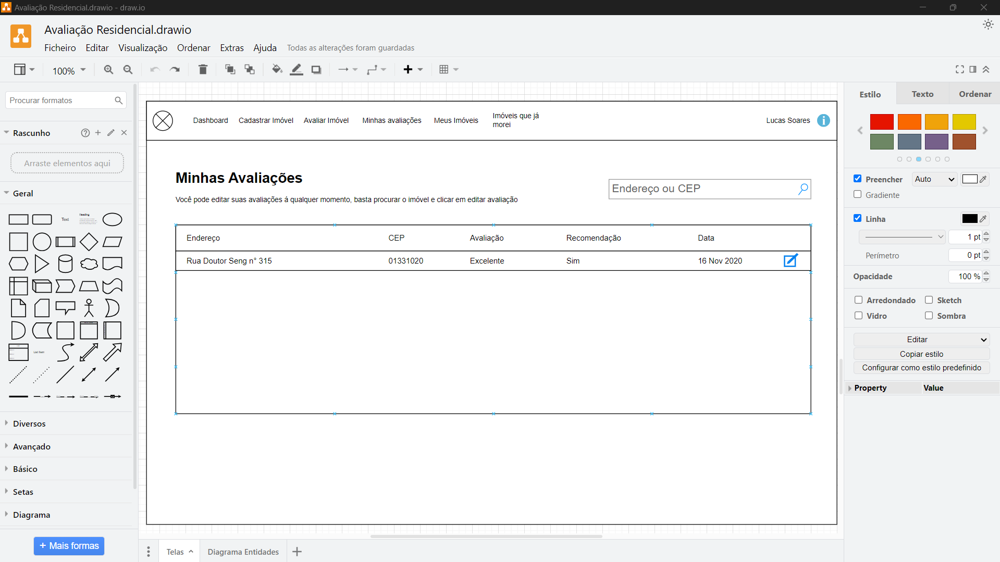
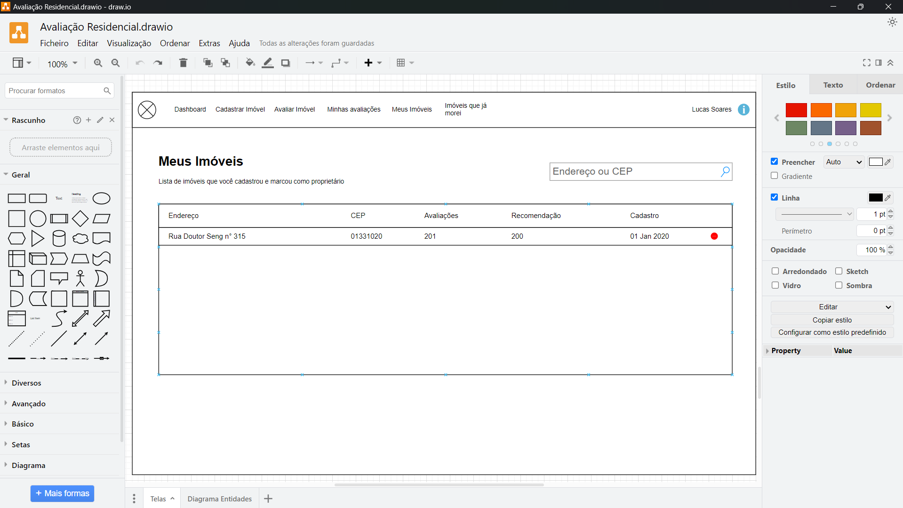
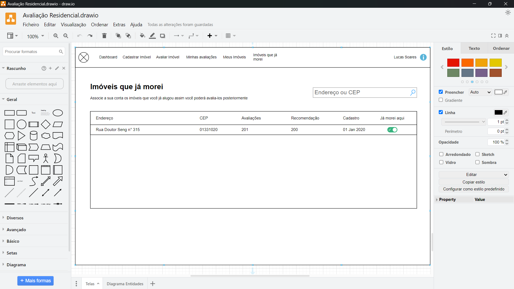

# App Avaliação de Imóveis em OutSystems

Aplicação em OutSystems Reactive de Avaliações de Imóveis

## Índice - PT

- [1ª Parte - Título da Parte 1](#documentação-da-1ª-parte)
- [2ª Parte - Título da Parte 2](#documentação-da-2ª-parte)
- [3ª Parte - Título da Parte 3](#documentação-da-3ª-parte)
- [4ª Parte - Título da Parte 4](#documentação-da-4ª-parte)
- [5ª Parte - Título da Parte 5](#documentação-da-5ª-parte)

## Readme in English - EN

If you are an English reader, visit the link below:

- [Click here documentation](/README-EN.md)

## Readme en Español - ES

Si eres un lector en español entra en el seguinte enlace:

- [Haga clic aquí](/README-ES.md)

-----------------------------------

## Documentação da 1ª Parte

- Entendendo o projeto através do template
- Criando o projeto em dois módulos Web e Services
- Entendendo a separação de responsabilidades
- Criando a arquitetura do banco de dados

### Mockups e Template das Telas

Antes de começar a implementação, iniciamos com o entendimento dos mockups das telas utilizando o **Drawio** e a importância de ter uma template visual, com os benefícios que pode trazer.

Esse planejamento visual ajudou a garantir que todos os elementos fossem claramente definidos antes da implementação, trazendo clareza à aplicabilidade.

As telas incluem:

- Tela de Login  
  
- Dashboard  
  
- Cadastro de Imóvel  
  
- Avaliar Imóvel  
  
- Pop-up Avaliar Imóvel  
  
- Minhas Avaliações  
  
- Meus Imóveis  
  
- Imóveis que já morei  
  

### Estrutura do Projeto

1. **Módulo AAR_Services (Service)**:
   - Responsável pela lógica de backend, incluindo a arquitetura do banco de dados, os relacionamentos e as ações CRUD.
   - O módulo foi configurado para ser **público**, permitindo que outros módulos acessem suas funcionalidades como leitura.
   - A arquitetura de entidades foi projetada para ser clara e garantir a integridade dos dados.  
     O diagrama de entidade (ER) foi criado para facilitar a visualização e segue abaixo uma prévia de cada tabela:
     
   - **Criamos o diagrama ER**:  
     
   - **Tabelas Criadas**:
     - **Tabela Immobile**: Contém os dados dos imóveis cadastrados, como CEP, endereço, cidade, proprietário, entre outros.  
       
     - **Tabela Rating**: Armazena as avaliações dos imóveis, incluindo informações como tempo de locação, recomendações e observações dos usuários.  
       
     - **Tabela TypeExperience**: Armazena os tipos de experiência relacionados aos imóveis. Possui registros como **Excelente, Bom, Neutro, Ruim, Péssimo**.  
       
     - **Tabela TypeImmobile**: Armazena os tipos de imóvel disponíveis (ex.: Casa, Apartamento, Loja). Possui registros como **Casa, Apartamento, Loja**.  
       
     - **Tabela UserxImmobile**: Relaciona usuários aos imóveis, indicando propriedades e ocupação.  
       São tabelas auxiliares que armazenam os tipos de experiência, tipos de imóvel e a relação entre usuários e imóveis.  
       
     - **Tabela User**: Utiliza a entidade padrão do sistema OutSystems para armazenar informações dos usuários, como data de criação e última alteração.  
       
2. **Módulo AAR_WEB**:
   - Responsável pelo front-end e pelas telas da aplicação.
   - Foi adicionado como dependência ao **AAR_WEB**, com acesso somente leitura, para garantir a segurança e centralizar toda a lógica de servidor no módulo **AAR_Services**.
   - No módulo web/reactive, é possível observar as abas completas, incluindo **Triggers, Interface, Logic, e Data**.  
     

### Conclusão

Essa primeira etapa do projeto incluiu a configuração inicial dos módulos e a criação das entidades do banco de dados, além da definição da interface do usuário.  
Utilizamos uma abordagem modular que facilita a manutenção e a segurança dos dados, separando a lógica de servidor do front-end.

Na próxima etapa, vamos nos concentrar em finalizar a estruturação das telas no módulo **AAR_WEB**, garantindo que todas as funcionalidades estejam alinhadas ao objetivo do projeto.

-----------------------------------

## Documentação da 2ª Parte

- Criação da Tela de Login e Cadastro de Imóveis e suas lógicas

### Tela de Login

- Aqui podemos observar, à direita, que por padrão a tela de Login da própria OutSystems vem com:  
  

#### 4 Variáveis Locais

- **Username**: Consumida no Input **E-mail**  
  
- **Password**: Consumida no Input **Senha**  
  
- **IsExecuting**: Utilizada para informar a execução de algo na ClientAction **OnInitialize**  
  
- **Remember**: Consumida no Input de Checkbox **Lembrar-me**  
  

#### 3 Client Actions

- **ForgotPassword**: Para recuperar a senha  
  
- **Login**: Usado no botão **Entrar**  
  
  - A lógica do Login recebe a variável local **IsExecuting** como True após o clique:  
    
  - Em seguida, a ServerAction **DoLogin** é chamada:
    - Recebe as variáveis locais: Username, Password, Remember.
    - Persiste os dados e verifica se foram salvos no banco.
    - Chama a ServerAction padrão de Login da OutSystems (dentro de User).  
        
        
        
      
  - Após, remove uma mensagem de feedback ao logar.
  - Por fim, redireciona o usuário para a tela principal:  
    
- **OnInitialize**:
  - Executa ações após o carregamento da tela (como na imagem abaixo):  
    
  - Utiliza a variável local "IsExecuting" (padrão False, sem ação inicial).  
    

-----------------------------------

### Mudando as ações de Autenticação para o caminho correto

- A lógica de servidor deve residir no módulo **ARR_Service**:
  - Recorte a ação da **ARR_WEB** e cole na **AAR_Service**, na aba **Logic**, e publique.  
    
  - Torne a ação pública antes de publicar, para que seja acessível de outros módulos.  
    
  - Aponte as dependências (busque o módulo, clique, adicione e “Apply”).  
    Os erros desaparecerão:  
    

-----------------------------------

## Tela de Cadastro de Imóveis

### Módulo ARR_WEB

- Exemplo de tela:
  
- A partir da aba **Data**, arraste para o **MainFlow**:
  - As duas telas são criadas:  
    
  - **Immobiles**: Tela de Listagem  
    
  - **ImmobileDetail**: Tela de registro
    - Remova o IF padrão (que indica "Cadastrar" ou "Editar") e substitua por uma Expression:
      - Se ImmobileId for nulo, exiba "Cadastrar"; senão, "Editar" concatenado com "Imóvel":

        ```javascript
        If(ImmobileId = NullIdentifier(), "Cadastrar", "Editar") + " Imóvel"
        ```

    - Remova o Form dentro da Column1 para que ele expanda:  
        
      
    - Arraste o **Adaptive/Columns2** para dentro do Form, dividindo as colunas:  
      
    - O layout ajustado fica assim:  
      
    - Troque o checkbox por radioGroup para melhor visualização:
      - Configure o Label como None (não vinculado) e ajuste a posição dos botões.  
        
    - Verifique a ClientAction **SaveDetail** para a persistência dos dados:  
      
      - Nota: A persistência ainda não está ativa:  
        
      - Visualmente, a tela ficou assim:  
        

### Módulo: ARR_Services

#### Tela Cadastrar Imóvel e Editar Imóvel

- Persistência dos dados na Tela "Cadastrar Imóvel":
  - Crie uma pasta com o nome da Tabela correspondente.
  - Crie a ação para persistir os dados.

- **Server Action: Immobile_CreateOrUpdate**  
  
  - A ação espera:
    - **Parâmetro de Entrada**: Immobile  
      (Para persistir a Tabela Immobile, use o parâmetro Immobile.)
    - **Parâmetro de Saída**: Output  
      - Crie uma Structure para o Output:  
        
      - Defina os atributos:
        - Success (padrão false)  
          
        - Message  
          
        - AccessKey  
          
        - Id (Long Integer)  
          
      - Após criar a Structure, defina o Parâmetro de Saída:  
        
  - Crie o fluxo da ServerAction:  
    
  - **Validação Inicial:**  
    - Verifique se o usuário é igual a NullIdentifier():  
      
  - Se **Immobile.Id** for nulo (novo registro):
    - Se Sim: Execute **CreateImmobile**
    - Se Não: Execute **UpdateImmobile**  
      
    - Caso seja um novo registro, preencha os campos **CreatedBy** e **CreatedAt** antes de persistir:  
      
    - No Source, remova o Immobile e adicione os campos individualmente:  
      
    - > ⚠️ **ATENÇÃO:** Utilize os valores do parâmetro de entrada para os campos, exceto **CreatedBy** (use GetUserId()) e **CreatedAt** (use CurrDateTime()).  
        
        
      
    - Os campos **CreatedBy** e **CreatedAt** são os únicos que não usam o valor do parâmetro de entrada.
      - **CreatedBy:** Função GetUserId()
      - **CreatedAt:** Função CurrDateTime()  
        
    - Observação:
      - Em **UpdateImmobile**: Atribua diretamente o parâmetro de entrada.  
        
      - Em **CreateImmobile**: Atribua os campos individualmente, estilizando o CreatedBy com GetUserId().  
        
  - Atribuição dos parâmetros de saída:
    - **1º:** Crie um Assign para o CreateImmobile, onde Output.Id recebe o ID do CreateImmobile.  
      
    - **2º:** Crie um Assign para o UpdateImmobile, onde Output.Id recebe o ID do registro atualizado.  
        
      
- >❗ **EXCEÇÃO:**  
  - Adicione uma exceção ao fluxo, escolhendo "Todas as Exceptions":  
    
  - Em um Assign, configure:
    - Output.Success = False
    - Output.Message = AllExceptions.ExceptionMessage  
    
  - Na exceção AllExceptions, o fluxo aborta (Abort Transcription = Yes).  
    

### Módulo: ARR_WEB

- Remova os elementos não utilizados:
  - Exclua o Aggregate **GetUsers**:  
    -   
    - 
- Crie o fluxo da **Client Action: SaveDetail**:
  - Valide se o formulário é inválido (False):  
    
  - Se válido, chame a ServerAction Immobile_CreateOrUpdate (passando o parâmetro Immobile):  
    -   
    - 
  - Utilize um IF para verificar a persistência:
    - Se falso, exiba mensagem de ERRO (Output.Message):  
      
    - Se verdadeiro, exiba mensagem de SUCESSO e redirecione para a tela de listagem **Immobiles**:  
      
    - Finalize com REDIRECT:  
      
- Valide em tela a persistência (observação: o CEP ainda está fictício; usaremos uma API para o CEP):  
  

### PRÓXIMA ETAPA

- ✨ **IMPLEMENTANDO O CEP**:
  - 🛠️ Crie uma ação **OnChange** para o campo **CEP**.
  - ✏️ Quando o campo **CEP** for alterado, um evento OnChange chamará um serviço que, se o CEP existir, preenche automaticamente logradouro, bairro e cidade.

-----------------------------------

## Documentação da 3ª Parte

- Criando Telas e lógica de Login e Cadastro de Imóveis:
  - Ajustes de labels
  - Utilização de componente da Forge (api)
  - Segurança da aplicação com AccessKey
  - Eventos OnChange
  - Evento OnScroolingEnd
  - Geração de AccessKey randômico
  - Utilização de Widget List ao invés de TableList
  - Join entre tabelas
  - Tela Meus Imóveis
  - Tela Avaliar Imóveis

## Start

## Gerando AccessKey randômico

- Atualmente, a edição ou ações exibidas na URL expõem o ID, o que gera vulnerabilidade.
- Para segurança, será utilizado o AccessKey, que mascara o ID.  
  

### Access Key ARR_SERVICES

- No módulo Services, a ServerAction (**Immobile_CreateOrUpdate**) possui no Output os parâmetros (*Success, Message, AccessKey, Id*).
- Porém, o fluxo (**CreateImmobile**) ainda não recebe o **AccessKey** pois não foi atribuído à tabela.  
  

#### Criando o Access Key

- 1º Crie um atributo na tabela Immobile na aba **Data**:
  - O atributo deve ser do tipo **Text** (para receber uma HASH).  
      
    
- 2º No fluxo da ServerAction (**Immobile_CreateOrUpdate**), na ação **CreateImmobile**, a AccessKey estará disponível.
  
- 3º Utilize uma função do sistema para gerar a AccessKey:
  - Nas dependências, adicione a ServerAction (**GenerateGuid**).  
    
- 4º Retorne ao fluxo da ServerAction (**Immobile_CreateOrUpdate**) e atribua a função ao atributo AccessKey do Immobile.  
  
  - Assim, cada novo registro gerará um AccessKey para ser utilizado no ARR_WEB no lugar do ID.
- 5º Publique e vá para o ARR_WEB.

### Access Key ARR_WEB

- No ARR_WEB, atualize as dependências (Refresh all → Apply → Publicar).  
  
- 1º A tela **ImmobileDetail** espera um parâmetro de entrada (**Immobile Identifier**); substitua-o por **AccessKey**:
  - DataType: **Text** (para receber uma hash).
  - Não precisa ser obrigatório.
  - Também altere o GET e a lista.  
    
- 2º Altere o **GetImmobileBy**:
  - O filtro deve comparar **Immobile.AccessKey** com o parâmetro **AccessKey**.  
    
- 3º No filtro do **GetImmobileBy**, defina o MaxRecord como 1 (busca única).  
    
- 4º Na lista de imóveis, altere o parâmetro de entrada para **AccessKey**.  
      
      
    

-----------------------------------

## Utilizando componente da Forge (api) CEP

- ✨ **IMPLEMENTANDO O CEP**:
  - 🛠️ Crie uma ação **OnChange** para o campo **CEP**.
  - ✏️ Ao alterar o campo **CEP**, o evento OnChange chamará um serviço que:
    - Se o CEP existir, preenche logradouro, bairro e cidade automaticamente.
    - Caso contrário, exibe uma mensagem de erro.

### Baixando o Componente na Forge (ViaCEP)

- Baixe o componente ViaCEP - Endereços:
  - Na aba **Forge**, procure por **ViaCEP** e instale-o no Studio.  
    

### Aplicando ARR_WEB

- 1º O componente ViaCEP é uma aplicação separada; adicione-o como dependência ao ARR_WEB.
  - Ele possui uma ServerAction (**CEP**) que recebe um parâmetro (CEP) e retorna um Output com os dados do endereço.  
    
  - Após aplicar, ele aparecerá na aba **Logic**.  
    
- 2º Na tela, no campo Input **CEP**, crie uma ação OnChange que acione uma trigger para chamar o serviço CEP.  
      
    
- 3º Aplicando a lógica:
  - Adicione um IF: se o comprimento do CEP for maior que 7 (ou seja, 8 caracteres ou mais):

    ```js
    Length(GetImmobileByAccessKey.List.Current.Immobile.CEP) > 7
    ```

  - Se falso, finalize; se verdadeiro, chame a API ViaCEP para obter os dados do CEP.
    
  - Arraste a ação **Via_CEP : CEP** da aba Logic, configure os parâmetros e conecte à condição.  
      
    
  - Configure os campos de Input para receber os valores do Output do CEP:
    - 1º Valide se o serviço retornou dados.
    - 2º Se CEP.Output.Erro for True, finalize.
    - 3º Caso contrário, use um Assign para preencher os campos de endereço.  
        
        
        
      
    - 4º Crie um Assign para limpar os campos caso haja alteração no CEP e o serviço retorne erro.  
      
    - ⚠️ **APRENDIZADO:** O OnChange permite buscar e manipular dados com base no valor preenchido.

-----------------------------------

## Tela Meus Imóveis

- Tela de Listagem de Imóveis:
  - Inicialmente, reutilize a tela para criar a listagem de imóveis.  
    
- Ajustes iniciais (para se aproximar do template):
  - 1º Altere o nome da página.
  - 2º Remova o link "Casa" (será usado no logradouro para edição).
  - 3º Edite as posições das colunas.
  - 4º Renomeie o botão para **Cadastrar Imóvel**.
  - 5º Adicione o link de edição na coluna **Logradouro**.
  - 6º Adicione a coluna de **Ação** com ícone de **Delete**.
  - 7º Adicione a coluna de **Cadastro**.  
    
- Configuração das **Expressions**:
  - 1º **Avaliações**: exibe a soma das avaliações do endereço.
    - Altere o Aggregate (GetImoveis) para fazer o join com a tabela de avaliações e agrupar os dados:
      - Crie um join:  
        
      - O join pode ser configurado como **With or Without** para trazer registros com ou sem avaliação.
      - Utilize **Group by** e **Count** para agrupar e contar:
        - Group by (ex.: CEP, Id, Street, Street_Number, CreatedAt, TypeMobile, AccessKey)  
          
        - Count dos registros:  
          
      - O Aggregate passa a mostrar apenas os campos agrupados:  
        
      - Retire a reordenação das colunas:  
        
      - Atualize as Expressions com os novos valores do Aggregate:  
        
      - Resultado final:  
        
  - 2º Ajuste a formatação do campo **Criado em** utilizando a função DateFormate():  
    
  - 3º Ajuste a ação do **Search** para buscar por CEP e Logradouro:  
    
- Criando a Ação **DELETE**:
  - 1º Crie uma ClientAction (no módulo ARR_WEB) vazia inicialmente.
  - 2º Crie a ServerAction no módulo ARR_Server:  
    
  - 3º Na aba **Data**, arraste a ação de Delete da tabela Immobile para a ServerAction, adicionando o parâmetro ID.  
    
  - 4º Configure o Output do CRUD:  
    
  - 5º Crie o fluxo de exceção (AllExceptions):  
    
  - 6º No módulo ARR_WEB, configure o fluxo que chama a ServerAction e exibe as mensagens de sucesso ou erro:  
      
      
      
    

## CRIANDO TELA DE AVALIAÇÕES

- **1º** Organize a Tela de Avaliação utilizando um componente **List** (Main Content > List > Container > Content\CardsSectioned).  
  
- **2º** Crie um Aggregate específico para esta tela:
  - Relacione a tabela **Immobile** com **UserXImmobile** (para trazer os imóveis em que o usuário já morou).
  - Relacione **Immobile** com **TypeImmobile** (usando join Only With).
  - Relacione **Immobile** com **Rating** (usando join With or Without).
  - Agrupe as informações e conte as avaliações:
    - Group by: Immobile.Id, Immobile.Street, Immobile.Street_Number, TypeImmobile.Label, Immobile.AccessKey  
    - Count: Rating.Id  
    
- **3º** Adicione o Aggregate ao Source:
  
  - Atualize as Expressions e estilize o Container:  
    
  - Crie um Group By em **TypeImmobile.Id** para exibir ícones conforme o tipo de imóvel:  
    
  - Crie um IF para exibir o ícone de acordo com o **TypeImmobile**:  
    
- **4º** Implemente o scroll infinito para carregar mais registros conforme o usuário rola:
  - Configure o evento **On Scroll Ending** do componente List com uma Client Action "New Infinite Scroll Client Action".  
      
    
  - A Client Action "ScrollEnding" utiliza uma variável local **MaxRecords** para definir quantos registros serão exibidos inicialmente.  
      
      
    

-----------------------------------

## Documentação da 4ª Parte

- Pop-up de Avaliação, Tela Minhas Avaliações, Imóveis que já morei e Ajustes Gerais:
  - Ajustes no menu
  - Modal de avaliação
  - Persistência de dados
  - Tela Minhas Avaliações
  - Tela Imóveis que já morei
  - Ajustes gerais

### Criando Modal de Avaliação

- Exibição do modal:  
  
- **1º** No módulo ARR_SERVICES, crie a ServerAction **Rating_CreateOrUpdate**:
  - Fluxo:
    - Se for um novo registro, utilize o CRUD "CreatingRating" e, via Assign, defina:
      - Output.Succes = True  
      - Output.Message = "Avaliação criada com sucesso"  
      - Output.Id = CreateRating.Id
    - Caso contrário, utilize o CRUD "UpdateRating" e defina:
      - Output.Succes = True  
      - Output.Message = "Avaliação atualizada com sucesso"  
      - Output.Id = Rating.Id
    - Ambos os fluxos se encerram com sucesso.
    - Em caso de exceção, via AllExceptions, defina:
      - Output.Succes = False  
      - Output.Message = AllExceptions.ExceptionMessage  
      
      
      
      
      
      
      
    
- **2º** No módulo ARR_WEB, crie o Pop-up (Modal) de Avaliação:
  - Adicione um componente para o popup e uma variável local **ShowPopupRating** (Boolean, default False).  
      
    
  - Atribua a variável ao Popup.  
    
  - Crie uma ClientAction (ex: **ShowPopupRating**) para inverter o valor da variável (para abrir/fechar o popup).  
      
    
  - Crie uma variável local para armazenar a tabela **Rating** a ser usada no formulário do popup.  
    
  - Ajuste a estrutura do popup (título, subtítulo, campos do formulário) conforme o mockup.  
    
- Ajustes adicionais:
  - 1º Troque o input de checkbox por um **Radio group** para as recomendações.  
      
      
    
  - 2º Altere o campo "Observação" para um **textArea** e defina o Label como "None".  
    
  - 3º Configure o Título e descrição do popup para serem dinâmicos, utilizando variáveis locais (por exemplo, "TypeImmobile" e "ImmobileAddress") que são atribuídas na ação **ShowPopupRating**.  
      
    
  - 4º Capture o ID da avaliação ao clicar, utilizando a variável local Rating.  
      
      
    
  - 5º Para persistir os dados do popup, crie a ClientAction **SaveOnClick** que:
    - Chama a ServerAction **Rating_CreateOrUpdate**.
    - Utiliza um IF para verificar se o Output indica sucesso ou erro e exibe a mensagem correspondente.
    - Se for sucesso, limpe as variáveis locais e feche o popup (atribuindo ShowPopupRating = False).  
      
      
      
      
      
      
    
  - 6º Em **Rating_CreateOrUpdate** (módulo Services), configure os campos **CreatedAt** (CurrDateTime()) e **CreatedBy** (GetUserId()).  
    
    - Atualize as dependências no módulo Web.  
      
  - 7º Crie a tela "MyRating" para listar as avaliações do usuário:
    - Utilize a tabela Immobile com join na tabela **Rating**.
    - Adicione um filtro para que somente as avaliações do usuário logado sejam exibidas:

      ```js
      Rating.CreatedBy = GetUserId()
      ```

      
      
    
    - Organize as colunas (Endereço, CEP, Avaliações, Recomendações, Data) e formate datas com DateTimeToDate().
      
    - Crie um campo "Search" para buscar avaliações por rua ou CEP:
      - Crie uma variável local "SearchRating" (Texto).
      - Configure a ação OnChange (ex: "SearchOnChange") para atualizar a lista se o comprimento do texto for >= 3 ou igual a 0:

        ```js
        Length(SearchRatings) >= 3 or Length(SearchRatings) = 0
        ```

        
        
      
      - No Aggregate, crie um filtro utilizando LIKE para os campos rua e CEP.  
        

-----------------------------------

## Documentação da 5ª Parte

- **Nesta Parte:**
  - Ajustes no menu
  - Evento de editar (tela minhas avaliações)
  - Tela de Dashboard
  - Consumo de dados de gráficos do módulo Services
  - Manipulação dos dados dos gráficos
  - Adição de atributo em Aggregate
  - Uso de Switch
  - Tela Imóveis que já morei
  - Ajustes gerais

### Ajustando menu

- Configure o menu com nomes padronizados para facilitar a navegação.  
  

-----------------------------------

### Criando a tela do Dashboard

- O dashboard exibirá gráficos com métricas importantes.
- 1º No módulo Services, na aba "Logic", crie uma pasta para ações de servidor do Dashboard.  
  
- 2º Crie uma ServerAction para cada gráfico.  
  
  - As ações devem ser públicas.  
    
- 3º Criando a ServerAction do Rating (Avaliações):
  - I - Arraste um Aggregate e adicione a tabela **Rating**.
  - II - Crie um join (Only With) com a tabela **TypeExperience**.
    - Realize um Count em Rating.ID e agrupe por TypeExperience.Label.  
        
      
  - 4º Passe os dados para uma estrutura compatível com gráficos, utilizando **DataPoint**.
    - Adicione 2 parâmetros de saída:
      - Output: estrutura com mensagem e sucesso.
      - Um parâmetro do tipo List of DataPoint.  
        
        
        
      
  - 5º Estruture o fluxo da ServerAction (Rating):
    - I - Crie o Aggregate com os joins e configure os parâmetros de saída.
    - II - Utilize a ação ListAppendAll para transferir os dados do Aggregate para o DataPoint.
    - III - Em um Assign, defina:
      - Output.Success = True  
      - Output.Message = "Dados coletados com sucesso"
    - IV - Configure o fluxo de exceção (AllExceptions):
      - Output.Success = False  
      - Output.Message = AllExceptions.ExceptionMessage  
        
        
        
      
- 4º Criando a ServerAction do ImmobileRegister:
  - De forma semelhante à ação de Rating, crie uma ação para contar registros de Immobile por data de criação.
  - I - Adicione os parâmetros.
  - II - No fluxo:
    - Arraste a tabela **Immobile**.
    - Realize um Count em Immobile.Id e agrupe por Immobile.CreatedAt.
    - Utilize ListAppendAll para preencher os DataPoints (Value = Count, Label = CreatedAt).
    - Em um Assign, defina:
      - Output.Success = True  
      - Output.Message = "Dados coletados com sucesso"
    - Configure o fluxo de exceção de forma semelhante.  
        
        
        
        
      
- 5º No módulo Web, atualize as dependências e crie os gráficos:
  - Crie uma tela chamada **Dashboard**.
  - Adicione título e subtítulo.
  - No Widget Tree, crie um Card com um layout de 3 colunas:
    - Em Column1, adicione um componente **PieChart**.
    - Em Column2, adicione um componente **LineChart**.
  - Na aba Interface > Elements, crie “Fetch Data from Other Source” para os gráficos:
    - Clique com o botão direito na tela Dashboard e selecione "Fetch Data from Other Source".
    - No fluxo, arraste as ServerActions para RatingGraph e ImmobileRegisterGraph.
    - Em um Assign, defina:
      - Para RatingGraph: DataPointList = RatingGraph.DataPoint
      - Para ImmobileRegisterGraph: DataPointList = ImmobileRegister.DataPoint
    - Configure os Outputs de cada Fetch como List of DataPoint.
    - Nos componentes de gráfico, defina a propriedade DataPointList utilizando os Outputs:
      - PieChart: RatingGraph.DataPointList
      - LineChart: ImmobileRegisterGraph.DataPointList  
        
        
        
        
        
        
        
        
        
        
        
      

-----------------------------------

### Criando a tela do "Imóveis que já morei"

- Nesta tela, o objetivo é utilizar um atributo calculado no Aggregate.
  - Configure o Dashboard como tela principal.
  - Crie uma Screen chamada **ImmobileLived**.
  - No Aggregate desta Screen:
    - Adicione a tabela **Immobile** e realize um Join com a tabela **UserXImmobile**.
    - Exiba os campos: Imóvel, CEP, Endereço + Número.
    - Adicione um Switch para indicar se o usuário já morou na residência.
      - Crie um novo atributo (New Attribute) no Aggregate com a fórmula:

        ```js
        CreatedAt <> NullDate()
        ```

  - Vincule o atributo ao componente Switch.
- No módulo Services, crie a lógica para o Switch:
  - Crie 3 ServerActions:
    - **UserXimmobile_CreateOrUpdate**: para criar ou atualizar o registro.
    - **UserxImmobile_Delete**: para deletar o registro.
    - **StatusChange**: para determinar, com base no status, se cria ou deleta o registro.  
        
        
        
        
      
- No módulo Web, atualize as dependências e configure o Switch:
  - No componente Switch, defina a variável local para receber o valor do atributo (ex.: `GetImmobiles.List.Current.Check`).
  - Configure o evento OnChange para chamar a ClientAction (ex.: "SwitchOnChange"), que invoca a ServerAction **StatusChange** com os parâmetros necessários.  
    
  - Na ClientAction "SwitchOnChange", trate o retorno:
    - Se Output.Success for True, exiba mensagem de Sucesso.
    - Se não, exiba mensagem de Erro.  
        
        
      
- Por fim, crie um Input Search para a tabela:
  - Crie uma variável local "SearchImmobile" (Texto).
  - No Aggregate, limite o Max.Record para 10 e crie um filtro para buscar por CEP e Endereço.  
      
      
    
